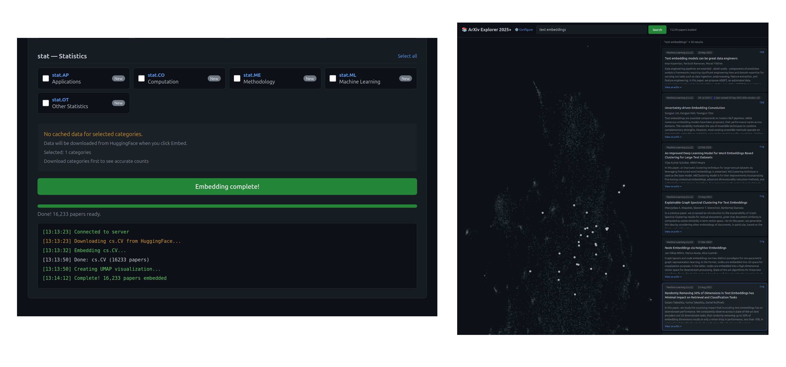

# ArXiv Explorer

A semantic search and visualization tool for exploring arXiv papers. Uses embedding models to enable natural language search over academic papers, with interactive UMAP visualizations.



## Features

- **Semantic Search**: Search papers by meaning, not just keywords. Query "neural networks for climate modeling" and find relevant papers even if they don't contain those exact words.
- **Interactive Visualization**: View papers as a 2D UMAP projection where similar papers cluster together. Zoom, pan, and explore the landscape of research.
- **Multi-year/Multi-month Support**: Download and embed papers from any available time period on arXiv (2020+).
- **Incremental Embedding**: Only embed new papers - previously processed data is cached and reused.
- **UMAP Caching**: Visualization results are cached based on your exact selection, so re-running the same query is instant.
- **Category Filtering**: Select specific arXiv categories (cs.AI, physics.*, math.*, etc.) to focus your exploration.

## Architecture

```
arxiv_explorer/
├── data/                 # Data management layer
│   ├── config.py         # Paths, constants
│   ├── hub.py            # HuggingFace Hub API interactions
│   ├── cache.py          # Local file caching
│   ├── loader.py         # Polars data loading
│   └── estimator.py      # Paper count estimation
├── routes/               # FastAPI route handlers
│   ├── categories.py     # Category listing/status
│   ├── download.py       # Data downloading & estimation
│   ├── embed.py          # WebSocket embedding handler
│   ├── search.py         # Semantic search endpoint
│   ├── papers.py         # Paper data endpoint
│   └── state.py          # Shared application state
├── embed_papers.py       # Embedding & UMAP logic
├── partition/            # Dataset partitioning tools
└── api.py                # FastAPI application
```

## Data Pipeline

1. **Source**: Papers come from the [permutans/arxiv-papers-by-subject](https://huggingface.co/datasets/permutans/arxiv-papers-by-subject) dataset on HuggingFace, which is partitioned by subject/year/month.

2. **Download**: On-demand downloading of parquet files for selected categories and time periods.

3. **Embedding**: Papers are embedded using [SnowflakeArcticEmbedXS](https://huggingface.co/Snowflake/snowflake-arctic-embed-xs) via [polars-fastembed](https://github.com/lmmx/polars-fastembed). Embeddings are cached per category/year/month.

4. **Visualization**: UMAP reduces embeddings to 2D for visualization. Results are cached based on the exact selection hash.

5. **Search**: Semantic search uses the same embedding model to find similar papers by cosine similarity.

## Setup

Requires Python 3.13+ and [uv](https://docs.astral.sh/uv/).

```bash
# Clone and install
git clone https://github.com/lmmx/arxiv-explorer
cd arxiv-explorer
uv sync

# For GPU acceleration (recommended)
uv sync --extra cuda
```

## Usage

### Running the Server

```bash
arxiv-serve
```

Then open http://localhost:8001

### Configuration

1. Go to http://localhost:8001/config
2. Select a year and months to include
3. Select categories (cs.AI, cs.LG, etc.)
4. Click "Embed" to download and process papers
5. Once complete, return to the main explorer

### Search

Type natural language queries in the search box:
- "transformer architectures for vision"
- "quantum computing error correction"
- "reinforcement learning robotics"

Results show similarity scores and highlight matching papers on the visualization.

## CLI Tools

```bash
# Partition the raw arXiv dataset (for maintainers)
arxiv-partition

# Embed papers directly (bypasses web UI)
arxiv-embed
```

## Data Storage

```
output/
├── data/                    # Downloaded parquet files
│   ├── 2025/01/cs_AI.parquet
│   └── ...
├── embeddings/              # Computed embeddings
│   ├── year=2025/month=01/cs_AI.parquet
│   └── ...
├── umap_cache/              # Cached UMAP results
│   └── umap_abc123.parquet
├── cache/                   # Metadata caches
│   └── subject_codes.json
└── arxiv_embeddings.parquet # Current active dataset
```

## API Endpoints

| Endpoint | Method | Description |
|----------|--------|-------------|
| `/api/categories` | GET | List categories with embedding status |
| `/api/available-years` | GET | Get available years |
| `/api/available-months/{year}` | GET | Get available months for a year |
| `/api/estimate` | POST | Estimate paper counts for selection |
| `/api/search` | GET | Semantic search (`?q=query&k=50`) |
| `/api/papers` | GET | Get all papers with coordinates |
| `/api/cache-summary` | GET | Get local cache statistics |
| `/ws/embed` | WebSocket | Streaming embedding progress |

## Development

```bash
# Run with auto-reload
arxiv-serve

# Type checking
uv run ty check

# Generate partitioned dataset from raw arXiv data
uv run --group partition arxiv-partition
```

## Acknowledgments

- Source dataset: [nick007x/arxiv-papers](https://huggingface.co/datasets/nick007x/arxiv-papers)
- Derived dataset: [permutans/arxiv-papers-by-subject](https://huggingface.co/datasets/permutans/arxiv-papers-by-subject)
- Embedding: [Snowflake Arctic Embed XS](https://huggingface.co/Snowflake/snowflake-arctic-embed-xs)
- Embedding library: [polars-fastembed](https://github.com/lmmx/polars-fastembed)

## License

MIT
